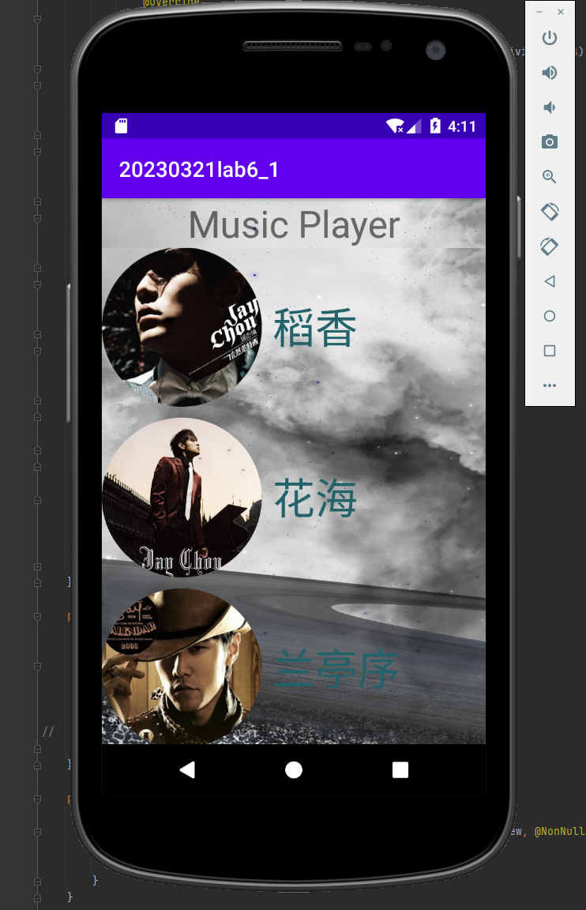
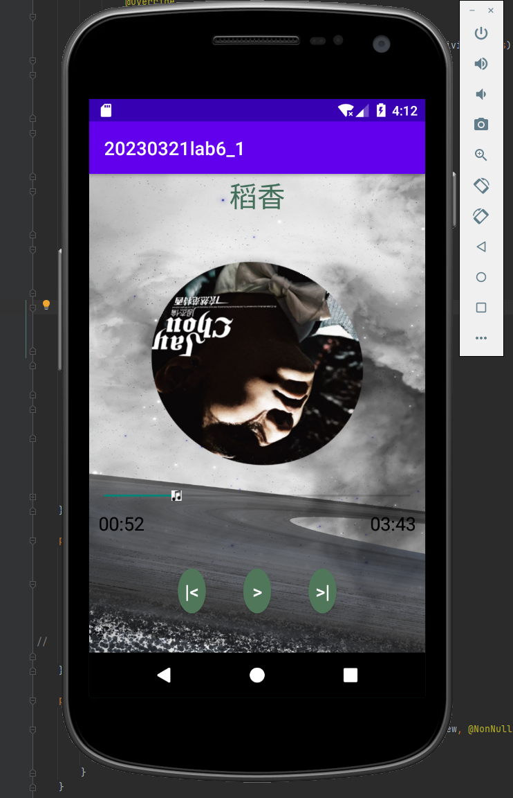

**It is a project of EE317(Advanced Experimental Studies I). The project is based on ["Android Studio"](https://developer.android.google.cn/studio/install).**  

## Requirement

### Android Studio Arctic Fox | 2020.3.1 Patch 4
Build #AI-203.7717.56.2031.7935034, built on November 21, 2021  
Runtime version: 11.0.10+0-b96-7249189 amd64  
VM: OpenJDK 64-Bit Server VM by Oracle Corporation  
Windows 10 10.0  
GC: G1 Young Generation, G1 Old Generation  
Memory: 1280M  
Cores: 16  
Registry: external.system.auto.import.disabled=true  

### SDK: Android 3.0(Honeycomb) | API level 11

### Virtual Device: Galaxy Nexus API 25 | Target: Android 7.1.1 | Resolution: 720 x 1280 : xhdpi  

## Interface  

### Main interface  

  

### Playing Interface

## What can the Music Player do?  

- Play songs! There are five Jay's songs stored in the [file](./app/src/main/res/raw/). You can download anysong youlike and alternate the original songs.  

- You can drag the progress bar to anywhere you like. And Play, Pause, Next, etc. as you wish.

